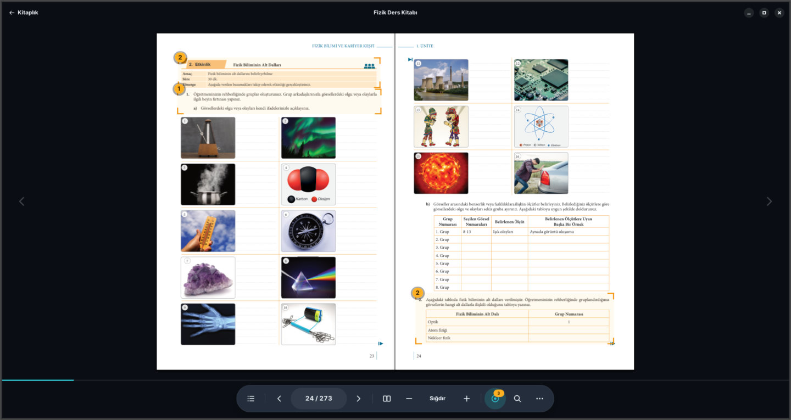
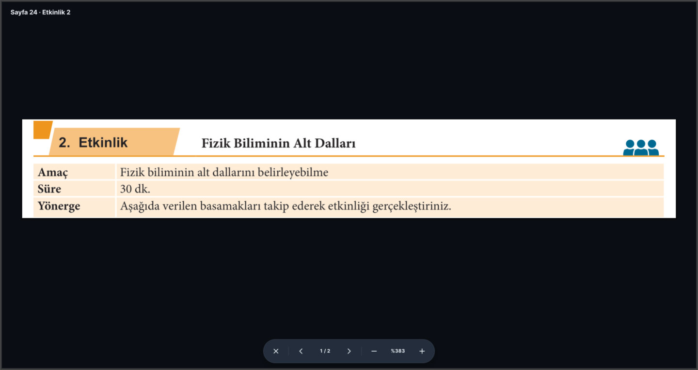

# Rayyan Ekitap

*[Türkçe](README.md)*

An interactive textbook reader for classroom smart boards. It opens the Turkish
Ministry of Education's secondary-school textbooks (grades 9–12, 56 books) on
the board; every activity on a page is marked in advance, and a touch on one
fills the screen with it at a size the whole class can read. On Pardus ETAP
boards it installs from a USB stick without an administrator password and
works offline.


## What it does

- **Library.** Books are grouped by grade; the book read last opens at the
  page it was left on with one touch. A book is downloaded once and then read
  offline.
- **Reading.** Two-page, single-page and scrolling views; fit to page, zoom,
  rotate; search inside the book; pages, contents and activity lists.
- **Activities.** Each activity is marked on the page. Touching it enters focus
  mode: the activity fills the screen and its questions are stepped through one
  by one. The publisher's interactive activities (EBA) open in the browser.
- **Made for a board.** Every control sits at the bottom of the screen, within
  reach; a page turns with a touch on the screen's edge or a swipe. The one
  field that would need the on-screen keyboard, the page number, has a number
  pad of its own. Four reading themes.





## Installing on a board

The app ships as a folder on a USB stick. When the stick is plugged into a
board, the desktop offers to run it; Rayyan Ekitap installs into the teacher's
account and starts. Details in [docs/kurulum.md](docs/kurulum.md) (Turkish).

Supported: Pardus ETAP 23.4 and 25 (Debian 12 and 13). The install is per
user, under `~/.local/share/interaktiv`; nothing on the system is touched.

## Running from source

Requirements: Python 3.11+, GTK 4.8+, libadwaita 1.2+, PyGObject, PyMuPDF.

```bash
sudo apt install python3-gi gir1.2-gtk-4.0 gir1.2-adw-1 xvfb   # Debian, Ubuntu, Pardus
pip install pymupdf psutil
./launch.sh
```

Tests: `python3 -m pytest`. To test against the board's library versions:
`packaging/board/test-floor.sh` (needs Docker). Developer documentation:
[docs/architecture.md](docs/architecture.md),
[docs/packaging.md](docs/packaging.md),
[docs/hotspot-pipeline.md](docs/hotspot-pipeline.md).

## Licence and content

Rayyan Ekitap is released under the GNU Affero General Public License v3.0
([LICENSE](LICENSE)); PyMuPDF, which renders the PDFs, is AGPL as well. The
textbooks are published by the Ministry of Education and downloaded from OGM
Materyal; Rayyan Ekitap neither alters nor redistributes their content. The Inter
typeface is used under the SIL Open Font License 1.1.
